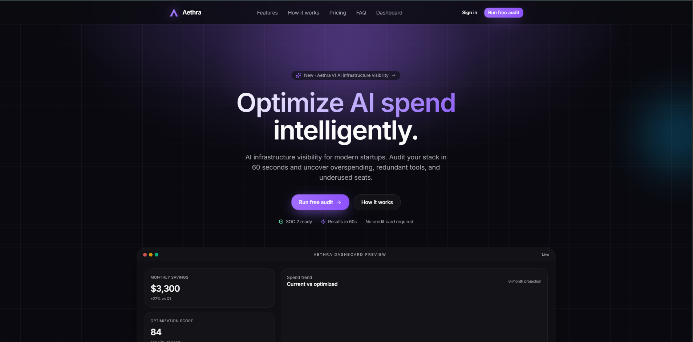
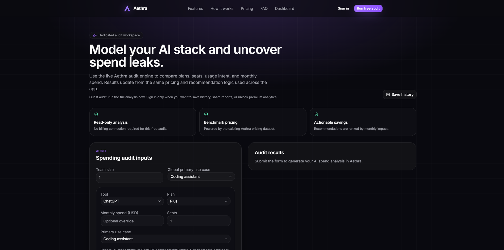
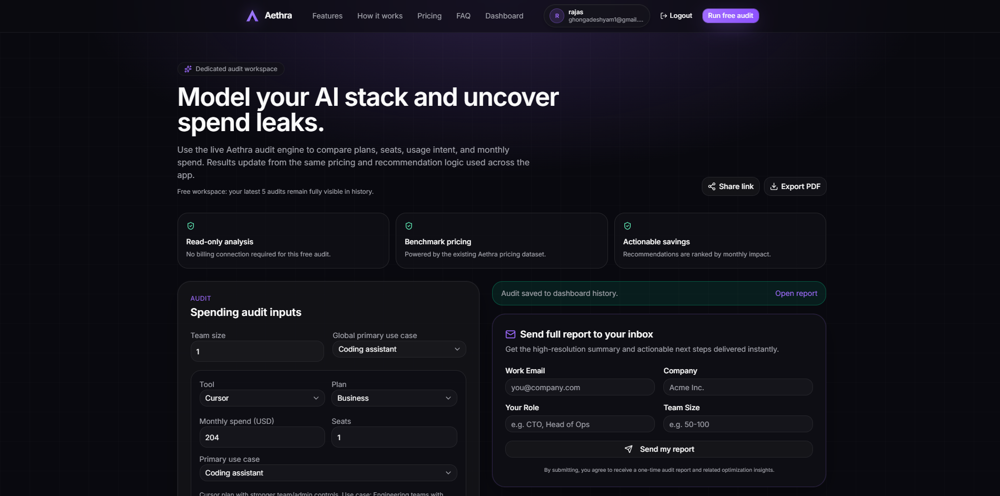
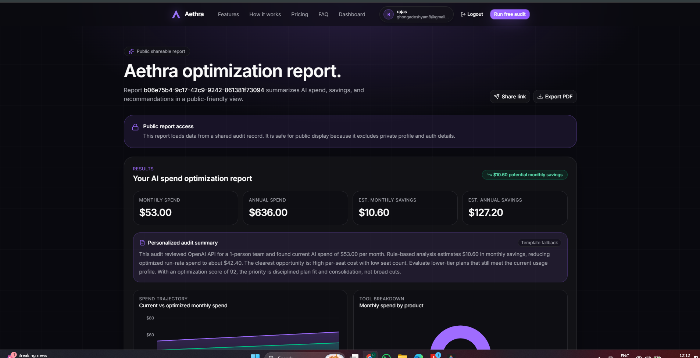
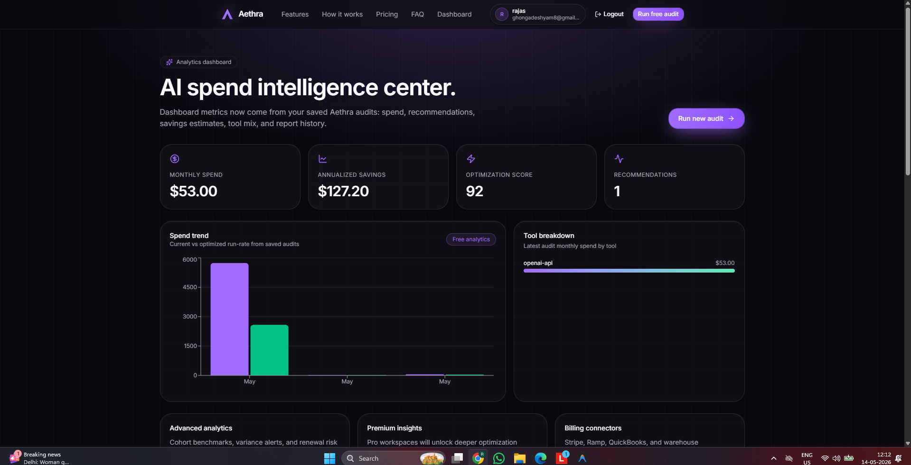
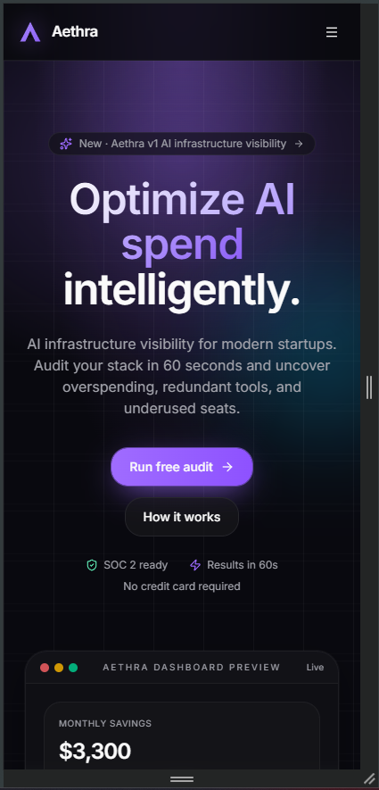

# Aethra

## AI Spend Optimization Platform for Startups and Technical Teams

Aethra is a lightweight AI spend optimization platform that helps startups analyze overlapping AI subscriptions, estimate unnecessary tooling costs, and generate shareable optimization reports.

The platform combines deterministic pricing analysis with AI-generated summaries to create realistic recommendations around:
- AI subscription overlap
- tooling redundancy
- plan overkill
- operational AI spend visibility

Built as part of the Credex Web Development Internship assignment.

---

# Live Deployment

Production URL:  
https://aethra-two.vercel.app/

---

# Problem

Startups and technical teams rapidly adopt AI tools like:
- ChatGPT
- Claude
- Cursor
- GitHub Copilot
- Gemini
- OpenAI APIs

However, most teams:
- do not track total AI spend centrally
- accumulate overlapping subscriptions
- overpay for unnecessary plans
- lack visibility into tooling redundancy

Aethra was designed to provide a fast, lightweight way to evaluate and optimize those AI stacks.

---

# Features

## AI Stack Auditing
Analyze AI tooling usage across coding, writing, research, and mixed workflows.

## Cost Optimization Recommendations
Identify:
- overlapping tools
- oversized plans
- potential savings opportunities

## AI-Generated Summaries
Generate readable audit explanations using Anthropic APIs.

## Public Shareable Reports
Create unique public report URLs for internal discussions and budgeting reviews.

## PDF Export
Export polished reports for presentations and operational reviews.

## Email Delivery
Send reports directly through transactional email workflows.

## Persistent Dashboard
Authenticated users can revisit previously generated audits.

## Anonymous Audit Flow
Users can generate audits without mandatory signup.

## Lightweight Abuse Protection
Frontend cooldowns and honeypot validation help reduce spam submissions while preserving low-friction UX.

---

# Screenshots

## Landing Page



---

## Audit Workspace



---

## Generated Report



---

## Public Share Report



---

## Dashboard



---

## Mobile Responsive View



---

# Tech Stack

## Frontend
- Next.js 16
- React
- TypeScript
- Tailwind CSS
- shadcn/ui

## Backend & Infrastructure
- Supabase
- PostgreSQL
- Vercel
- Resend
- Anthropic API

---

# System Architecture

The application follows a hybrid architecture:

- deterministic TypeScript logic handles pricing analysis and optimization reasoning
- AI is used primarily for narrative summaries and personalization
- Supabase manages authentication, persistence, and public report storage
- public reports are retrieved securely using RPC-based access patterns
- frontend abuse protection is intentionally lightweight to preserve anonymous usability

Detailed architecture notes are available in:
- ARCHITECTURE.md
- REFLECTION.md

---

# Why I Chose Deterministic Logic Over Fully AI-Generated Logic

One of the biggest architectural decisions was intentionally limiting how much decision-making was delegated to AI.

Early prototypes relied more heavily on LLM-generated recommendations, but this created:
- inconsistent financial reasoning
- unstable recommendations
- difficult-to-validate outputs

The final system instead uses:
- deterministic pricing calculations
- rule-based overlap analysis
- structured savings estimation

while AI is used only to improve readability and personalization.

This produced:
- faster responses
- more stable outputs
- easier debugging
- more financially defensible recommendations

---

# Quick Start

## Clone Repository

```bash
git clone https://github.com/rajas2007/ai-spending-auditor.git
cd ai-spending-auditor
```

---

## Install Dependencies

```bash
npm install
```

---

## Environment Variables

Create a `.env.local` file:

```env
NEXT_PUBLIC_SUPABASE_URL=your_supabase_url
NEXT_PUBLIC_SUPABASE_ANON_KEY=your_supabase_anon_key
ANTHROPIC_API_KEY=your_anthropic_key
RESEND_API_KEY=your_resend_key
```

---

## Run Development Server

```bash
npm run dev
```

---

## Production Build

```bash
npm run build
```

---

# Database Design

The project uses Supabase PostgreSQL with:
- profile persistence
- audit storage
- lead capture storage
- public report retrieval

Key architectural decisions:
- row-level security enabled
- anonymous audit flow supported
- secure RPC used for public reports
- lightweight lead capture system

---

# Abuse Protection Strategy

The assignment required basic abuse protection while preserving anonymous usability.

The final implementation intentionally avoids aggressive backend restrictions because they interfered with guest persistence flows during development.

The current protection system includes:
- frontend cooldown logic
- hidden honeypot field
- lightweight validation

This approach preserves:
- low-friction onboarding
- anonymous audit generation
- stable persistence behavior

---

# Lighthouse & Performance

Production Lighthouse testing achieved approximately:

| Category | Score |
|---|---|
| Performance | 85–92 |
| Accessibility | 90+ |
| Best Practices | 90+ |
| SEO | 90+ |

Optimization work included:
- reducing expensive visual effects
- simplifying animations
- improving hydration stability
- optimizing client/server rendering behavior

---

# Documentation Files

The repository also includes:

- ARCHITECTURE.md
- DEVLOG.md
- REFLECTION.md
- TESTS.md
- PRICING_DATA.md
- PROMPTS.md
- GTM.md
- ECONOMICS.md
- USER_INTERVIEWS.md
- LANDING_COPY.md
- METRICS.md

---

# Key Lessons Learned

The biggest technical lesson from this project was that overengineering relatively small requirements can destabilize core product functionality.

During development, I initially implemented more aggressive backend abuse-protection logic, but it created conflicts with anonymous audit persistence and Supabase RLS policies.

Simplifying the system ultimately produced:
- better reliability
- cleaner architecture
- easier debugging
- better UX

The project also reinforced that AI systems work best when augmenting deterministic logic rather than replacing it entirely.

---

# Future Improvements

If given additional development time, I would focus on:
- role-specific audit flows
- benchmarking against similar startups
- richer analytics
- collaboration features
- stronger audit personalization
- more advanced pricing intelligence

---

# Testing

The project includes:
- build validation
- lint validation
- audit engine test scaffolding
- manual production flow testing

Validated flows include:
- audit generation
- persistence
- public sharing
- PDF export
- email delivery
- responsive behavior

---

# Notes

Aethra was intentionally designed to behave more like:
- a startup MVP
- a lead-generation utility
- an operational decision-support product

rather than a purely academic coding assignment.

The primary focus throughout development was:
- realistic product thinking
- operational usefulness
- practical UX
- deployment stability
- explainable optimization logic